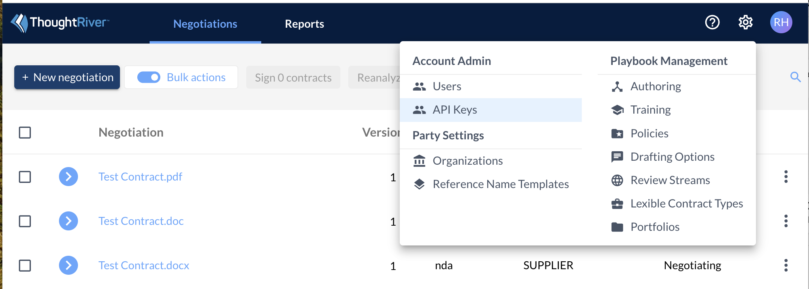
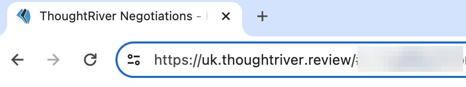

# Documentation-and-Samples

## Generating API Keys

API Keys are generated for an individual user.  That is, each user has a distinct pair of API Keys which distinctly identify them within the ThoughtRiver platform.

ThoughtRiver Support need to enable this feature on a customer by customer basis, so if you do not see the API Keys menu item below, please contact support:

When you first select the API Keys menu item you will be shown a screen to generate your unique API Key pair:

Clicking the Generate Keys button will generate a Primary and Secondary API Key.  Please make sure to save these keys as you will not be able to retrieve them after closing this page.  

Both the Primary and Secondary API keys allow you to access the ThoughtRiver API.  Your application should initially be configured to use the Primary API key.  At such time that you wish to rotate your API Keys as part of your security best practice you should first configure your application to use the Secondary API Key and then click the Rotate Keys button.  

Rotating the keys will cause the Primary Key to be set to the Secondary Key and then the Secondary Key is assigned a new value.

## API Base URL

A ThoughtRiver Customer instance is hosted in 1 of 3 regions.  Each of which has its own base URL.  You can tell which region you are hosted in by looking at the ThoughtRiver Web Appication URL:

Noties the `uk` signifying this URL is for the UK region.

The ThoughtRiver APIs are accessible via the following base URLs:

UK - `https://api2-uk.thoughtriver.review/api/`

US - `https://api2-us.thoughtriver.review/api/`

AP - `https://api2-ap.thoughtriver.review/api/`

## Uploading a contract

TBD

## Being notified a contract has been processed

TBD

## Retrieving a contract analysis report

Once a contract has been processed you can retrieve an analysis report using the following endpoint.

`https://api2-uk.thoughtriver.review/api/contract-content/v1_0/contract-versions/{version-uuid}/report`

The `version-uuid` can be found by observing the UUID in a contracts URL within the ThoughtRiver Web Applicaiotn following the following path `/version/` in the query string.

An example payload is available using the ThoughtRiver API [Contract Content OpenAPI](https://api2-uk.thoughtriver.review/api/contract-content/latest/docs#/Versions/get_contract_version_report) docuemntation.

## Additional APIs

Additional ThoughtRiver APIs are available by reviewing the [OpenAPI specification](https://api2-uk.thoughtriver.review/api/contract-content/latest/docs).  Not all APIs are accessible using user generated API Keys and unless documented here are not officially supported by ThoughtRiver.

