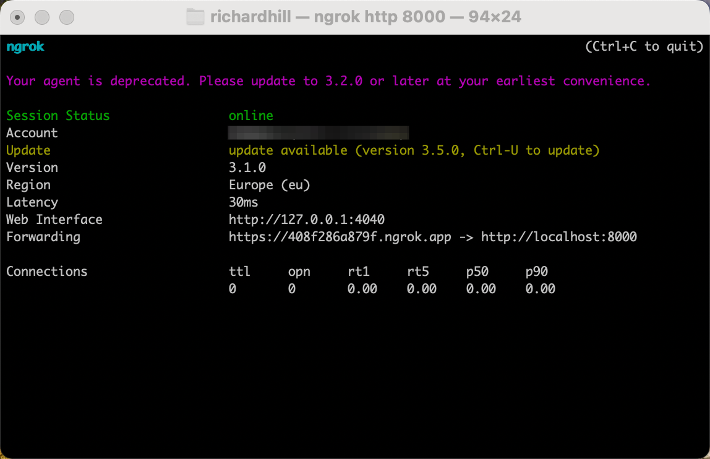
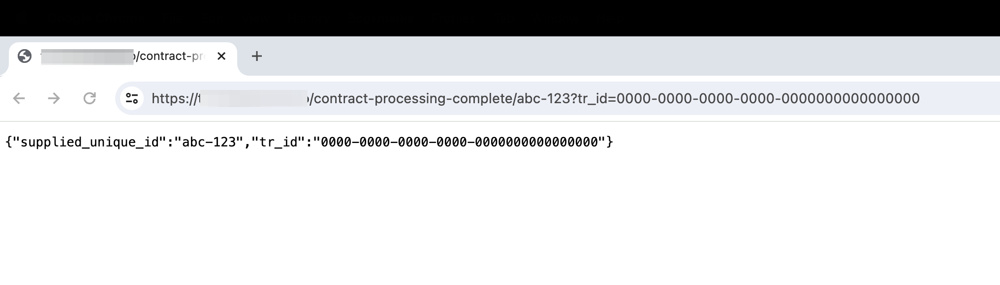
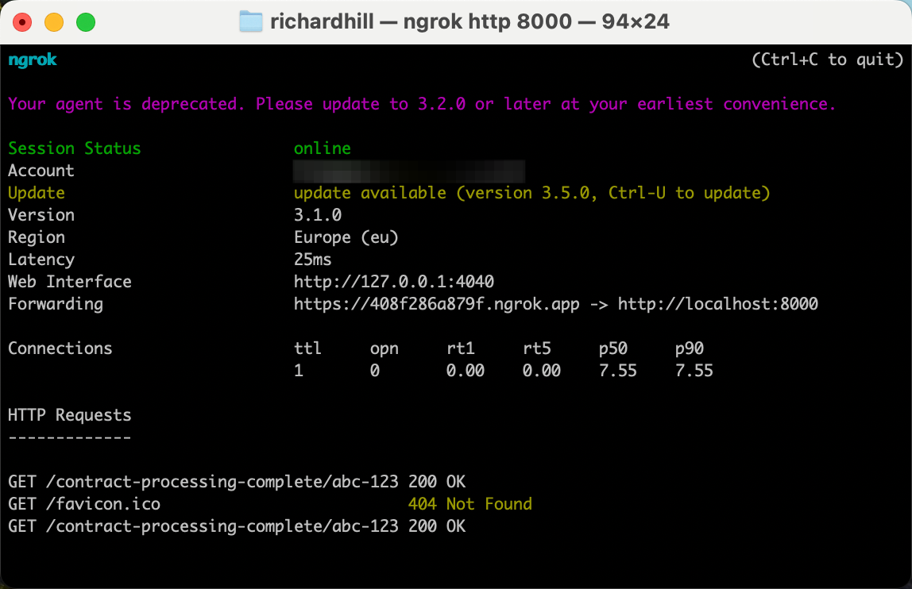

## What is a Contract Processing Complete Web Hook URL?
A Contract Processing Complete Web Hook URL is a public URL where the ThoughtRiver Platfrom can send HTTP GET requests to let a 3rd party know that a contract has completed processing.

It can be supplied to the ThroughtRiver Platform when using ThoughtRiver's API to upload a contract or contract version.

The path and query string of this URL can be of your own design, but it is recommended it is unique for each contract, including a unique identifier for each contract uploaded to the API by your system.

This sample uses the following URL structure:

`/contract-processing-complete/{contract_id}?tr_id={thoughtriver_version_id}&upload_status={status}`

where the `contract_id` path variable should be supplied as part of the callback URL given when uploading the contract and unique to each contract uploaded. The `thoughtriver_version_id` is the ThoughtRiver Platform version id for the uploaded contract. The `status` is the state of the contract in the ThoughtRiver platform when processing finishes. It is either `success` indicating a successful upload and processing completed, `awaiting_*` indicating user action required, or `fail_*` indicating that the contract has failed at a particular stage.

When the calling code supplies the call back URL it should do so using the following f-string:

`f"{callback_base_url}/contract-processing-complete/{upload_unique_id}?tr_id={{thoughtriver_version_id}}&upload_status={{status}}"`

_NOTE: the double curly braces `{{ }}` around `thoughtriver_version_id` and `status` indicate that the ThoughtRiver platform will replace these with the contract version id and status respectively.  Whereas only has single curly braces `{ }` indicates `upload_unique_id` is replaced by the calling code._

## Using a local Request URL for development
If you’re just getting started with your app development, you probably don’t have a publicly accessible URL yet.  Eventually, you’ll want to set that up, but for now a development proxy like [ngrok](https://ngrok.com/docs/what-is-ngrok/) can be used.

Once you’ve installed a development proxy, like [ngrok](https://ngrok.com/docs/what-is-ngrok/), run it to begin forwarding requests to a specific port (we’re using port 8000 for this example):

`ngrok http 8000`

_Note: It is only necessary to signup to ngrok for a free account.  When making the callback, the ThoughtRiver Platform automatically adds a [header to bypass the ngrok browser warning](https://stackoverflow.com/a/73844702/4807557)._

## Run the sample Web Hook FastAPI Server

From a terminal, located within the `receive-webhook-notifications` folder:

- Create a new virtual environment 
  - `python -m venv .venv`
- Activate the virutal environment 
  - `source .venv/bin/activate`
- Install [FastAPI dependencies](https://fastapi.tiangolo.com/#requirements)
  - `pip install fastapi`
  - `pip install "uvicorn[standard]"`
- Run the FastAPI server
  - `uvicorn receive_webhook_notifications.main:app --reload`

## Test ngrok and Web Hook FastAPI Server 

From a browser take the URL from the ngrok terminal and form a full URL to the Contract Processing Complete endpoint:

For the example ngrok development proxy above, this would be:

`https://408f286a879f.ngrok.app/contract-processing-complete/abc-123?tr_id=0000-0000-0000-0000-0000000000000000`

The incoming requests can be seen in the ngrok terminal window:

