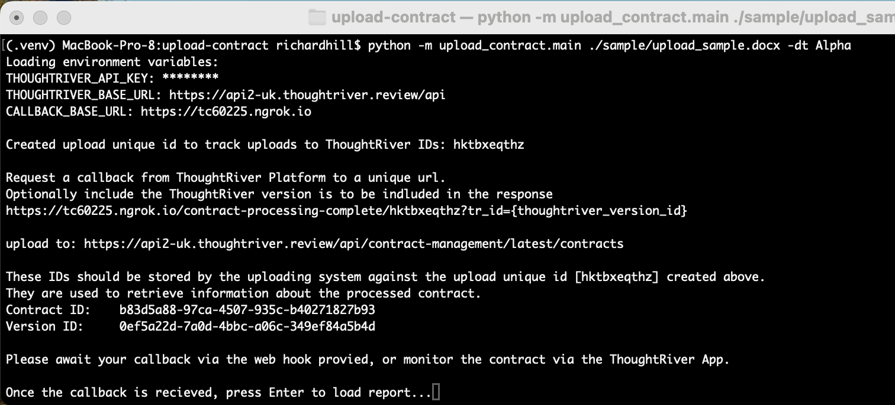
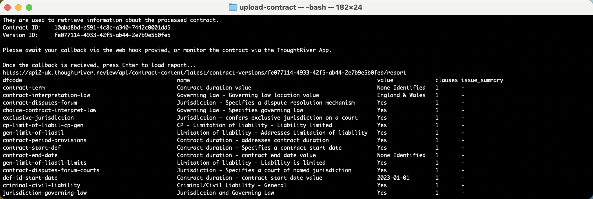

## Contract Upload and Report Sample

This sample uploads a contract to the ThoughtRiver Platform and then retrieves a contract report to show the predictions and issues created.

When used in conjunction with the [receive-webhook-notifications](../receive-webhook-notifications/README.md) service, a contract can be uploaded and the user can receive a notification of completion. The user can then download the contracts report:

## Installing and running the sample

From a terminal, located within the `upload-contract` folder:

### Installation

- Create a new virtual environment 
  - `python -m venv .venv`
- Activate the virutal environment 
  - If on a Mac or Unix based environment run: `source .venv/bin/activate`
  - If on a Windows based environment run: `.venv/Scripts/activate`
  - Please note that if you are running on a Windows based environment you may experience the error '.venv\Scripts\Activate.ps1 cannot be loaded because running scripts is disabled on this system'.
    This can be resolved by [enabling scripts](https:/go.microsoft.com/fwlink/?LinkID=135170).
- Install the following requirements
  - `pip install requests`
  - `pip install python-dotenv`
- create a .env file within the `upload-contract/upload_contract` folder and specify the following environment variables:
  - `THOUGHTRIVER_API_KEY={your_key}`
  - `THOUGHTRIVER_BASE_URL=https://api2-{your_region}.thoughtriver.review/api`
  - `CALLBACK_BASE_URL=https://{your_ngrok_instance}.ngrok.app`

### Upload a contract

When uploading a contract you need to specify the path to the contract document and the deal type to upload the contract to:

`python -m upload_contract.main ./sample/upload_sample.docx -dt {your_review_stream}`

 If you are also running the [receive-webhook-notifications](../receive-webhook-notifications/README.md) sample then you should await your callback via the web hook provided. You can also monitor the contract via the ThoughtRiver App.

Once the contract has finished processing press Enter to see the results from the contract report endpoint.

